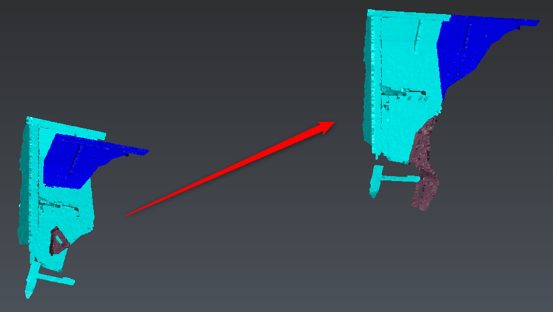
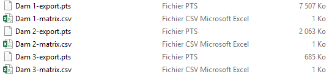

# AlignedClouds-BatchExport

The aim of this script is to export clouds which have been aligned and to export the matrix of each movement from measured to aligned cloud.

To use this script, select the aligned clouds and launch the script. Then modify the file path and the export format within the dialog. Note both clouds must have the same name and a corresponding suffix (import or export). At the end of the computation, the script will save the clouds in the chosen format and create a csv per matrix.

# Download Files

You can download individual file using these links (for text file, right click on the link and choose "Save as..."):

- [AlignedClouds-BatchExport.js](./AlignedClouds-BatchExport.js)
- [Sample.3dr](./AlignedClouds-BatchExport/Sample.3dr)