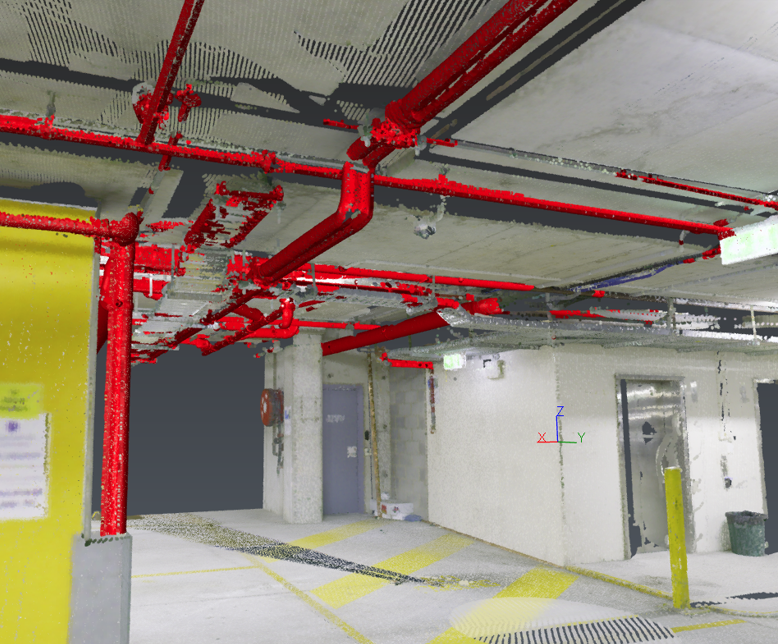

# Automating Pipe classification

| Script info |  |
| -------- | ------- |
| Contact | Jennifer CLEAR |
| Email | jclear@crkennedy.com.au |

This script is used for a webinar series teaching how to start writing scripts in 3DR.

## Description

This script runs the Indoor Constructon Site 1.3 classification on a point cloud and extracts the Pipe class.
It can be easily adapted to run an other classification model and extract a different class.

## Tested version

The following script has been tested on the following release versions:
- Cyclone 3DR 2025.1.0
- Cyclone 3DR 2025.2.0

## Licensing

This script is compatible with Survey, AEC, Plant or Pro Edition of 3DR.

## Files

- The main script: [Classification-Pipes.js](./Classification-Pipes.js)
- Sample Data: [Classification-Pipes.3dr](./Classification-Pipes.3dr)