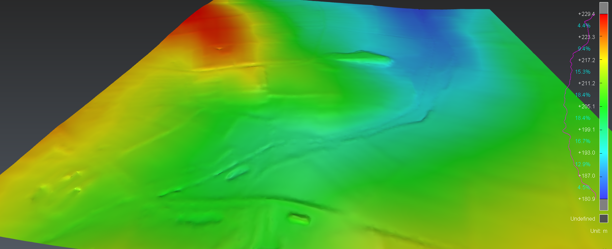

# Demo template

| Script info |  |
| -------- | ------- |
| Contact | Jennfier CLEAR |
| Email | jclear@crkennedy.com.au |

## Description

This script asks the user to select a mesh and colours it along the Z axis. 
For a terrain, this would be useful to understand the topography.
It can be easily adapted to colour the mesh according to any direction.

## Tested version

The following script has been tested on the following release versions:
- Cyclone 3DR 2025.1.0
- Cyclone 3DR 2025.2.0

## Licensing

This script is compatible with any module of 3DR.

## Files

- The main script [DemoScript.js](./ColourMeshAlongZ.js)
- Sample Data: [DataSet.3dr](./ColourMeshAlongZ.3dr)