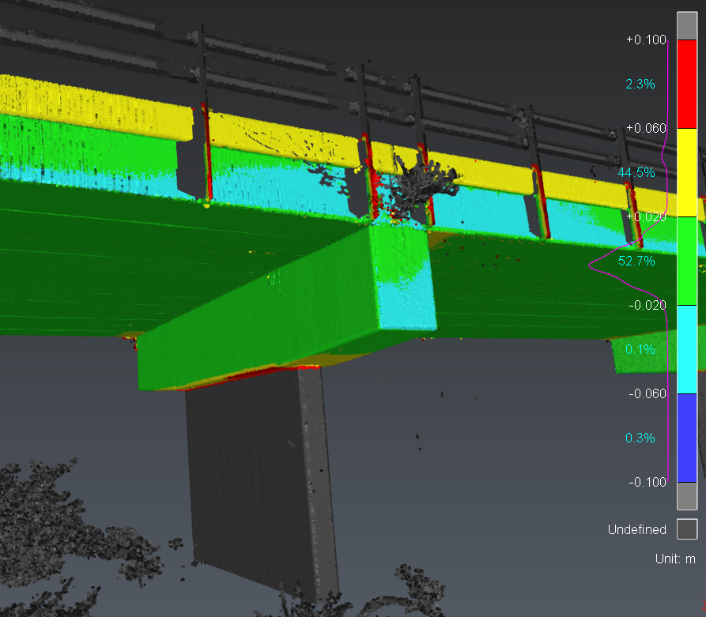

# Mesh-Cloud Inspection

| Script info | |
| -------- | ------- |
| Contact | Jennifer CLEAR |
| Email | jclear@crkennedy.com.au |

This script is used for a webinar series teaching how to start writing scripts in 3DR. 

## Description

This script compares a point cloud to a mesh; both selected by the user when prompted by the script.
The colour gradient resulting from the inspection will be modified to have 5 regular steps.

## Tested version

The following script has been tested on the following release versions:
- Cyclone 3DR 2025.1.0
- Cyclone 3DR 2025.2.0

## Licensing

This script is compatible with any module of 3DR.

## Files

- The main script: [MeshCloudInspection.js](./MeshCloudInspection.js)
- Sample Data: [MeshCloudInspection.3dr](./MeshCloudInspection.3dr)