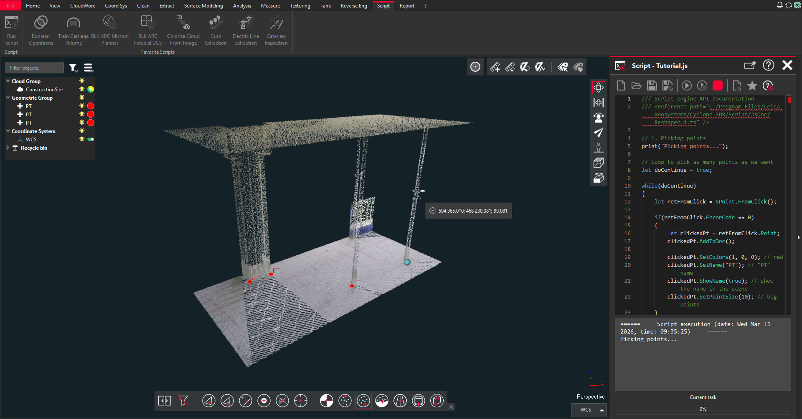

# Cyclone 3DR Scripting Webinar Series - Tips'n Trick 2026

| Script infos |  |
| -------- | ------- |
| Author | Leica Geosystems |
| Contact | https://github.com/Cyclone3DR/Scripts/issues |

## Description

This tutorial has been used as support material during the "Cyclone 3DR Scripting Webinar Series - Tips'n Trick" on March, 2026.

It is composed of two steps:

1. Pick points and customize them
1. Export all points to a CSV file

## Tested version

The following script has been tested on Cyclone 3DR 2026.0.

## Licensing

This script is compatible with any Cyclone 3DR edition.

## Files

- The main script [Tutorial.js](./Tutorial.js)
- Sample data: [Dataset.3dr](./Dataset.3dr)