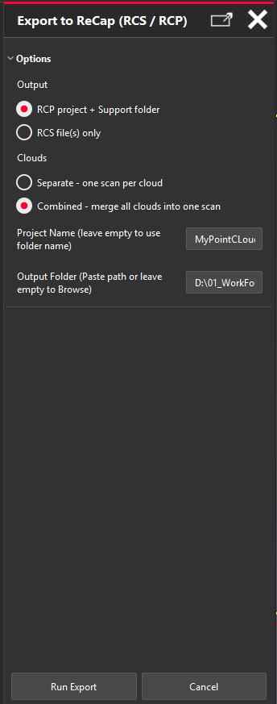

# Cyclone 3DR to Autodesk ReCap Exporter

A seamless, 1-click script for Leica Cyclone 3DR that completely automates the tedious export-to-ReCap workflow. 

Instead of exporting `.e57` files, opening Autodesk ReCap, importing them manually, waiting for the indexing to finish, and saving the project—this script handles the entire pipeline in the background while you continue working in 3DR.

## 🚀 How it Works
1. Select one or more point clouds in Cyclone 3DR.
2. Run the script and choose your export options (RCP vs RCS, Combined vs Separate).
3. The script briefly exports temporary high-quality `.e57` files (retaining scanner setup data).
4. The script dynamically generates a PowerShell worker and launches Autodesk's hidden command-line engine (`DeCap.exe`) in the background.
5. `DeCap.exe` indexes the point clouds into native `.rcp` or `.rcs` formats.
6. The script automatically cleans up the massive temporary `.e57` files to save disk space.

## ⚠️ Prerequisites
**You MUST have Autodesk ReCap Pro installed and licensed on your machine.**
This script hooks directly into `DeCap.exe` (Autodesk's command-line processing engine), which requires a valid ReCap Pro license to operate.

Default installation path expected by the script:
`C:\Program Files\Autodesk\Autodesk ReCap\DeCap.exe`

## ⚙️ Options
* **Output Mode:** Choose whether you want a full `.rcp` project with a support folder (best for dropping straight into Revit/Navisworks), or just raw standalone `.rcs` files.
* **Cloud Grouping:** 
  * **Separate:** Converts each selected 3DR point cloud into its own individual scan within ReCap.
  * **Combined:** Merges all selected 3DR point clouds into a single, unified scan during export.
* **Project Name:** Specify a custom project name, or leave it blank to automatically use the output folder's name.
* **Output Folder:** Paste your target path directly, or leave it blank to browse for a folder manually.

## 💻 Background Processing
Because the heavy lifting (indexing) is handed off to PowerShell and `DeCap.exe`, Cyclone 3DR remains completely free and unfrozen. A black command console will remain open on your screen showing real-time indexing progress. Once the window closes, your files are ready!

## ☑️ Tested Version
Tested on Leica Cyclone 3DR 2026.1 (and compatible with newer versions).

## 📄 Licensing
Compatible with all editions of Cyclone 3DR (Standard, Survey, AEC, Tank).
Distributed under the MIT License.

## ✉️ Support & Contact
Created by Thomas Mathey
**Email:** thomas@globalsurvey.co.nz
