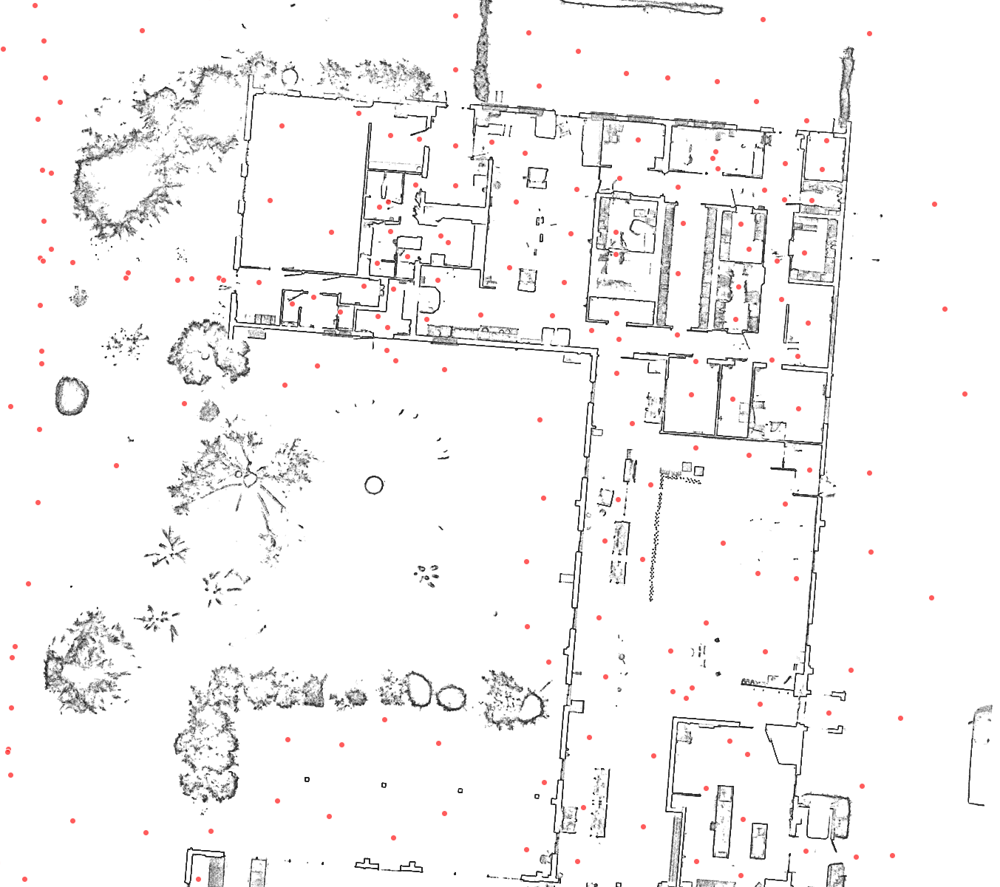

# NavVis Panoramas → Georeferenced Floor Plans

| Script infos |  |
| -------- | ------- |
| Contact | Amir SHIRZADI |
| Email | amir.shirzadi@sparte.io |
| Company | SPARTE |
| LinkedIn | https://www.linkedin.com/in/amirshirzadi/ |

Two [Cyclone 3DR](https://leica-geosystems.com/products/laser-scanners/software/leica-cyclone/leica-cyclone-3dr) scripts that turn a set of NavVis panoramas + a registered point cloud into an organized, per-building / per-level dataset: a georeferenced floor-plan orthophoto plus the panos that belong to each floor, ready to feed a 360° pano-viewer web app.

The pipeline is two steps:

1. **`import_panos_by_folder.js`** — batch-import the NavVis panoramas into the Cyclone scene and pose each one from the NavVis poses CSV.
2. **`export_ortho_with_panos.js`** — per building (a selected point cloud) and per level (a clicked floor), export a floor-plan orthophoto (TIFF + world file), the panos on that floor, the pano image files, metadata JSON, and an optional self-contained web QC viewer.

Both scripts are standalone — copy either `.js` into Cyclone 3DR and run it. No dependencies between the two files.

## Description

The importer batch-loads every scan's panoramas from a single root folder and poses each pano from its NavVis CSV. The exporter then slices the point cloud at each floor you pick, renders a top-down georeferenced floor plan, and buckets the panoramas onto their level — producing a tidy `Building/Level/panos` dataset plus an optional browser QC viewer that shows each floor plan with a dot at every pano position.



*Above: a Ghost/X-ray floor-plan orthophoto with a red dot at every pano position (QC-viewer output).*

## Tested version

The following scripts have been tested on the following release version:
- Cyclone 3DR 2026.1

## Licensing

- **Survey license required** — `SImage.ExportOrthoImage` (orthophoto export) and `SImage.Save` (pano image export) both need it. Without a Survey license those calls fail.
- **Windows only** — the export script uses `cmd` (`rmdir`) for recursive folder cleanup and Windows path handling.
- The scripts reference the type definitions at
  `C:\Program Files\Leica Geosystems\Cyclone 3DR\Script\JsDoc\Reshaper.d.ts`
  (only for editor autocomplete; not required to run).

## Author / Credits

Created by **Amir SHIRZADI (SPARTE)** — amir.shirzadi@sparte.io — https://www.linkedin.com/in/amirshirzadi/.
Shared with the Cyclone 3DR community; use and adapt freely for your own workflows.

## Files

- Importer: [import_panos_by_folder.js](./import_panos_by_folder.js)
- Exporter: [export_ortho_with_panos.js](./export_ortho_with_panos.js)
- Sample Data: **TODO** — add a dataset ≤ 100 MB here, or link to an external host (Google Drive, Dropbox, …) if larger.

---

## Requirements

- **Cyclone 3DR 2026.1** (uses the JavaScript scripting host).
- **Survey license** — required by `SImage.ExportOrthoImage` (orthophoto export) and `SImage.Save` (pano image export). Without it those calls fail.
- **Windows** — the export script uses `cmd` for recursive folder cleanup (`rmdir`) and Windows path handling.
- The scripts reference the type definitions at
  `C:\Program Files\Leica Geosystems\Cyclone 3DR\Script\JsDoc\Reshaper.d.ts`
  (only for editor autocomplete; not required to run).

---

## Step 1 — Import the panoramas

Run **`import_panos_by_folder.js`**. Select **one root folder** that contains your scan subfolders; every scan's panos are imported automatically.

**Expected on-disk layout** (NavVis export style), per scan:

```
<root>/
  <scanFolderA>/
    pano/
      00000-pano.jpg
      00001-pano.jpg
      ...
      pano-poses-registered.csv      (preferred)
      pano-poses.csv                 (fallback if the registered file is absent)
  <scanFolderB>/
    pano/
      ...
```

The poses CSV is `;`-delimited with columns:
`ID ; filename ; timestamp ; pos_x ; pos_y ; pos_z ; ori_w ; ori_x ; ori_y ; ori_z`

**Resulting Cyclone scene tree** — each scan is kept in its **own** group:

```
/PANOS/<scanFolderA>/images/00000-pano.jpg, ...
/PANOS/<scanFolderA>/points/00000-pano.jpg, ...   (optional name points)
/PANOS/<scanFolderB>/images/...
```

**Dialog options:**

| Option | Meaning |
| --- | --- |
| Root folder | The parent folder holding the scan subfolders. |
| Top tree group name | Top-level group that holds every scan (default `PANOS`). |
| Create name points | Add a labelled point at each pano position. OFF by default (faster for large batches). |
| Clear existing images first | Remove all images from the document before importing (keeps existing points). |

**Progress:** a throttled console bar + ETA. Because Cyclone's console only repaints between operations, the script also writes a live log to `<root>/_import_progress.log`. Watch it in another window:

```powershell
Get-Content -Wait "<root>\_import_progress.log"     # PowerShell
```
```bash
tail -f "<root>/_import_progress.log"               # Git Bash
```

The script is designed for large batches (thousands of images) and runs sequentially.

---

## Step 2 — Export the dataset

Run **`export_ortho_with_panos.js`**. Select the **building point cloud(s)** first (one cloud = one building), then run the script and pick the floor levels.

**Output folder layout:**

```
<outputRoot>/
  manifest.json                     master index of the whole dataset
  viewer.html                       self-contained web QC viewer (optional)
  Building_<name>/
    building.json
    Level_1/
      plan_L1_Z<z>.tif              georeferenced floor-plan orthophoto
      plan_L1_Z<z>.tfw              world file (georeference)
      plan_L1_Z<z>.tif.json         sidecar metadata (optional)
      preview.png                   downscaled preview for the web viewer (optional)
      level.json
      panos/
        <scanName>/
          0000001__00000-pano.jpg   <uid>__<originalName>.jpg
          ...
    Level_2/
      ...
```

**How levels work:** for each level you pick a floor datum Z. The script slices the cloud in a horizontal band **above** that floor (default 1.0–1.5 m above), renders that slab top-down into the plan, and buckets each pano to the highest floor at or below its Z.

**Key dialog options:**

| Option | Meaning |
| --- | --- |
| Buildings (source clouds) | Selected clouds, or all visible clouds. |
| Plan render style | RGB / Intensity / Classification / **Ghost (X-ray)**. Ghost gives the cleanest CAD-style plan. |
| Pixel size (GSD) | Ground sampling distance (meters/pixel). Auto-coarsened if a plan would be too large. |
| Background color | White / Black / Light grey / Custom. |
| Band from / Band to | Slab thickness above each floor datum, in meters. |
| Levels from | Click floors interactively, or use pre-selected scene points (by Z). |
| Export pano images | Save each pano's pixels via `SImage.Save`. Off = JSON only (fast dry run). |
| Make web QC viewer | Emit a preview PNG per level + `viewer.html`. |
| Output root folder | The **parent** folder for the dataset. |

**Web QC viewer:** if enabled, open `viewer.html` in any browser (no server needed). Pick a building/level in the sidebar to see the floor plan with a red dot at every pano position; hover a dot for its scan/name.

---

## How the two scripts fit together (important)

The exporter recovers **which scan each pano belongs to** by reading the scan name back out of the scene tree path `/PANOS/<scanName>/images/...` that the importer creates. This matters because NavVis restarts numbering at `00000` in every scan, so filenames collide across scans.

- **Keep the per-scan tree intact.** If the tree is flattened to `/PANOS/images/...`, the scan namespace collapses and the exporter prints a **SCAN NAMESPACE WARNING**. (Images stay safe — see below — but the viewer can no longer group panos by scan.)
- As a hard safety net, every exported pano gets a **globally unique** on-disk filename `<uid>__<name>.jpg`, so `SImage.Save` can never overwrite one pano with another even if scan names collide.

---

## Conventions worth knowing (if you modify the code)

These are non-obvious and load-bearing — changing them incorrectly produces wrong output rather than an error:

- **Georeference is CORNER convention.** The `.tfw` origin is the **top-left corner** (`line5 = minX`, `line6 = maxY`), not the ESRI pixel-center. Pano-dot placement math is therefore `pixelCol = (worldX - minX) / gsd`, `pixelRow = (maxY - worldY) / gsd` with **no half-pixel offset**. Get this wrong and every dot is misplaced.
- **Background color packs as BGR, not RGB:** `blue * 2^16 + green * 2^8 + red`.
- **Ghost / X-ray style** = the `flat` cloud representation + a dark color + transparency on a white background (the Revit/CAD "x-ray" plan look).
- **Elevation tags avoid dots.** A `Z12.18` tag becomes `Z12p18` because Cyclone truncates the world-file name at the first `.`, which would otherwise produce a mismatched `.tfw` stem.
- **`AddToDoc()` must precede `MoveToGroup()`** for both images and points (importer).
- **NavVis pose flip:** the importer right-multiplies each quaternion by the 180°-about-X quaternion `(0, 1, 0, 0)` to match NavVis's orientation convention.

---

## Coordinate system / projection

Coordinates are treated as **local, UTM-like** — the scripts do **not** assign an EPSG code (the metadata leaves `epsg: null`). Set the correct CRS in your viewer / GIS if you need real-world georeferencing. The manifest includes a `falseOriginHint` (the global minimum X/Y) to help.

---

## License / sharing

Shared with the Leica Cyclone 3DR community. Use and adapt freely for your own workflows.
