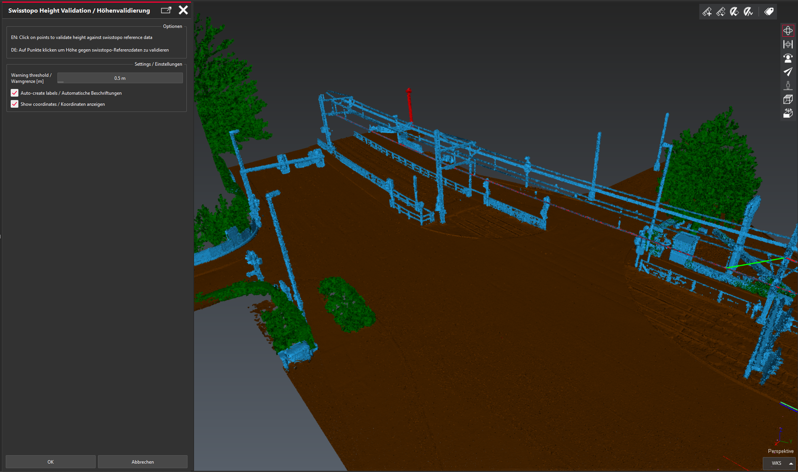

# Swisstopo Height Validation Tool for Cyclone 3DR

| Script info |  |
| -------- | ------- |
| Contact | Jan Sigrist, Bimatic GmbH |
| Email | jan.sigrist@bimatic.ch |

## Description

Interactive quality control tool for comparing elevation data against official swisstopo reference heights. Click on any point in a mesh or point cloud and the script instantly compares the local height against the swisstopo height API.

swisstopo data should be used as a reference aid only: there can be an undetermined time span between the acquisition of the swisstopo reference data and the object being controlled.

**Deutsch:** Interaktives Qualitätskontroll-Tool zum Vergleich von Höhendaten gegen swisstopo-Referenzhöhen. Klicken Sie auf beliebige Punkte in Ihrem Mesh oder Ihrer Punktwolke, um lokale Höhenmessungen sofort mit swisstopo-Daten zu vergleichen. Swisstopo-Daten sind nur als Hilfsmittel zu betrachten, da zwischen der Erfassung der swisstopo-Daten und dem zu kontrollierenden Objekt eine unbestimmte Zeitspanne liegen kann.

### What's new (2026-09-01)

- **Continuous workflow**: no more "continue?" dialog after every click. The script keeps validating until Esc; a per-point result popup is now opt-in (off by default) instead of forced.
- **Session summary**: on exit, one dialog reports how many points were checked, how many passed, how many exceeded tolerance, how many lookups failed, the mean deviation and the largest absolute deviation.
- **Coordinate guardrail**: a point clicked outside Switzerland's LV95 extent is caught immediately with a clear message instead of surfacing as an unexplained API failure.
- **Bilingual dialogs**: field names, tooltips and messages are English / German throughout.
- **Reliable transport**: height lookups go through a curl subprocess with a 30 second timeout. The script engine's own `fetch()` API intermittently fails inside the GUI process with an SSL certificate-chain error when calling `api3.geo.admin.ch`; curl as a separate process is not affected.
- **Readable failures**: every error names the step it happened in, and the message is never blank, even for exceptions the engine throws as bare strings or objects.

## Tested version

- Cyclone 3DR 2026.1.2.50530 (headless and interactive)
- Should run on Cyclone 3DR 2025.1 or newer (no dependency on the 2026.1.2 `fetch()` runtime)

## Licensing

Free to use and adapt, no warranty. Compatible with any Cyclone 3DR edition (Standard, Survey, Advanced).

## Usage

1. Run the script from the Cyclone 3DR Scripts menu.
2. Set the tolerance, and optionally enable per-point popups.
3. Click points in your 3D data. Labels are created automatically (unless disabled); out-of-tolerance points additionally get a red marker sphere.
4. Press **Esc** to stop. A summary dialog reports the session statistics.

### Label information

Each label has 3 columns:
- **Measure**: local height at the clicked point
- **Reference**: swisstopo reference height
- **Deviation**: local minus reference

The label comment states the verdict ("OK" or "Deviation ... > tolerance ..."), and labels are grouped under `Swisstopo Validation/OK` or `Swisstopo Validation/FAILED`.

## Requirements

- **Leica Cyclone 3DR 2025.1** or newer
- **curl** command-line tool (built into Windows 10/11, must be on PATH)
- Internet connection to `api3.geo.admin.ch`
- Project georeferenced in **LV95 (EPSG:2056)**, coverage area Switzerland and Liechtenstein

## Technical details

- **API**: `https://api3.geo.admin.ch/rest/services/height?easting={E}&northing={N}&sr=2056&format=json`
- **Coordinate system**: LV95 (EPSG:2056)
- **Data source**: swisstopo DTM-AV, via `api3.geo.admin.ch`

## Troubleshooting

| Problem | Solution |
|---------|----------|
| "swisstopo API unreachable" | Check internet connection / firewall / proxy for curl |
| Point silently skipped | Point is outside the LV95 extent of Switzerland |
| No labels created | Check that "Create labels automatically" is enabled |

## Data limitations

- **Temporal accuracy**: there can be a significant time gap between swisstopo data acquisition and the surveyed object.
- **Reference purpose only**: use for QA / plausibility checks, not as a substitute for a professional survey validation where that is required.

## Files

- Main script: [Swisstopo validation.js](./Swisstopo%20validation.js)

## Version history

- **2026-09-01**: Continuous workflow, session summary, LV95 guardrail, bilingual dialogs, curl-based transport, readable error handling
- **v2.1** (Cyclone 3DR 2025.1.4): numeric-only label cells
- **v2.0**: enhanced bilingual interface and error handling
- **v1.0** (2025-08-25): initial release

---

## Disclaimer

This tool provides reference comparisons for quality control purposes only. swisstopo data should be used as a reference aid; there may be an undetermined time span between swisstopo data acquisition and the object being controlled. Verify data accuracy for your specific application and comply with professional surveying standards where required. Use at your own risk.

**Data attribution:** (c) swisstopo - Swiss Federal Office of Topography. Height data from `api3.geo.admin.ch`.
