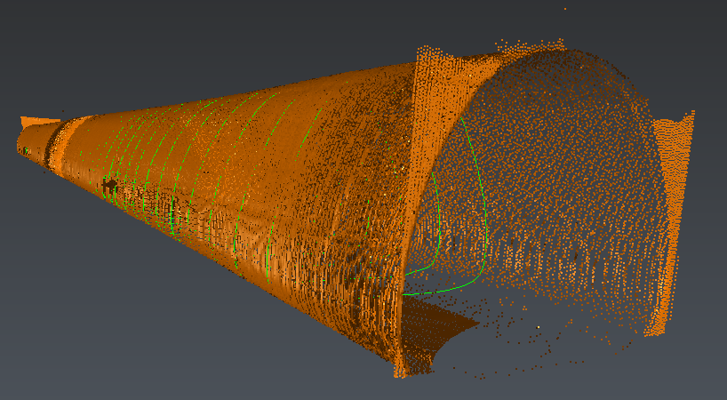
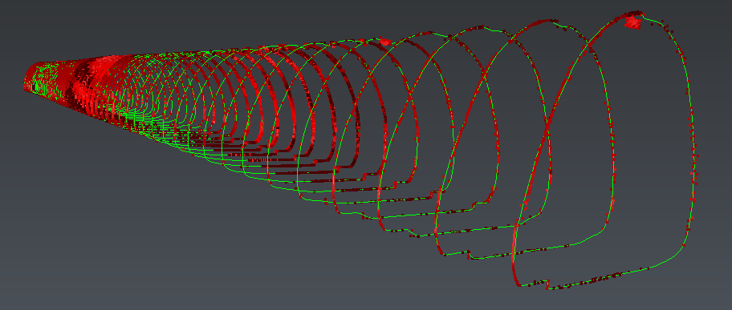

# Cloud_sections

The aim of this script is to segment a point cloud according to cross-sections (or planar polylines). 

To use this script, simply select the cloud and the polylines and launch the script. You need to enter a threeshold corresponding to the half thickness of the slices. Note that one cloud will be created per polyline. 

# Download Files

You can download individual file using these links (for text file, right click on the link and choose "Save as..."):

- [Cloud_sections.js](./Cloud_sections.js)
- [Cloud_sections.3dr](./Cloud_sections.3dr)