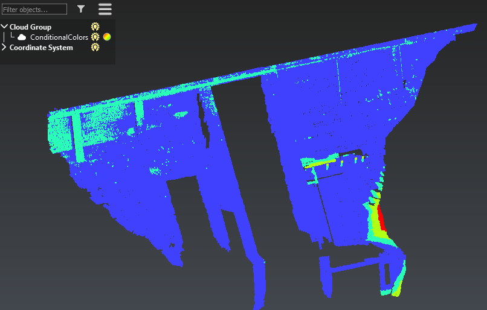
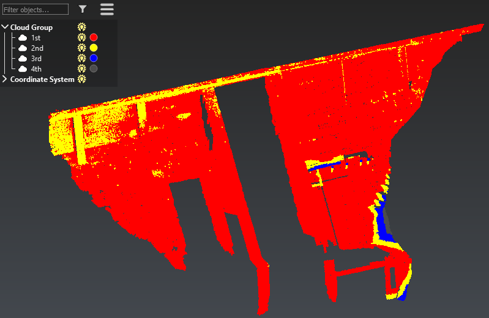

# Conditional Colors

The aim of this script is to apply conditionnal colors to a cloud which has been inspected and colored by ranges (1color=1range).

To use this script, color the point cloud (note each color has to match a range), modify the script to define the colors and conditions which will be applied on each range, select the point cloud and run the script. 

# Download Files

You can download individual file using these links (for text file, right click on the link and choose "Save as..."):

- [ConditionalColors.js](./ConditionalColors.js)