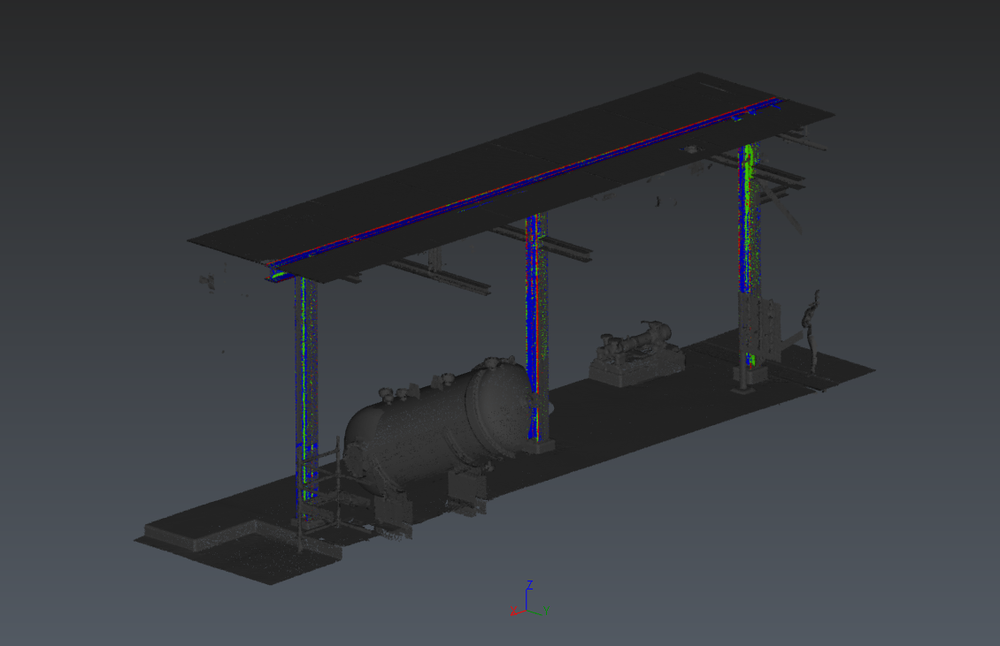

# Inspection Classification

 This script demonstrates how point cloud classification can be used to highlight deviation information in regards of a BIM object.
 
 A deviation analysis is perform between a selected cloud and a BIM object. Then, a class is assigned to each deviation intervals.

 
 
 Follow the steps below to use it:

 1. Before running the script, you may edit the class settings with your own customization
 1. Select a BIM and a point cloud. If not, the script will ask for it.
 1. Setup the script parameters to define the deviation parameters and type of output
 1. Run the deviation analysis
 1. Assign a class to each deviation intervals
 1. Optionaly, export a new LGSx file

# Download Files

You can download individual file using these links (for text file, right click on the link and choose "Save as..."):

- [Sample.3dr](./Sample.3dr)
- [Deviation Classification.js](./Deviation%20Classification.js)
