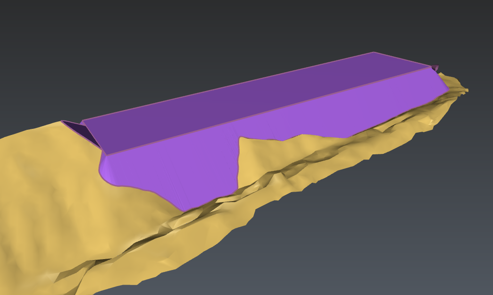

# Earth embankment
This script provides a functionality to draw embankments.
To use it, open the script editor and load EarthEmbankment.js.

# HOW TO USE IT
The algorithm uses the clicked polyline, the clicked mesh and the given slope to compute the earth embankment => Make sure 1 polyline and 1 mesh, at least, are visible before launching the script. Note the earth embankment will be drawn on the right side of the polyline.

# ALGORITHM USED
1. The algorithm resamples the clicked polyline.
2. It computes the direction of the slope.
3. Then, it computes the earth embankment polyline. Optionally, it creates smooth corners.
4. The earth embankment polyline is unbuckled and reprojected onto the mesh.
5. A mesh is automatically computed according to the clicked polyline and the earth embankment polyline.
6. Note: you may want to isolate parts of this mesh ->use Surface Modeling>Cut mesh.
7. Note: you may need to reverse this mesh ->use the contextual menu or shortcut i.

# PARAMETERS
Parameter explanations:
1. Slope(%): the slope of the embankment
2. iMulti resampling (document unit): the resampling of the input polyline. This will add computations along the straight lines of the input polyline.
3. cone resampling (degrees): give a positive value to create cones in convex corners (0 to ignore). 

# Download Files

You can download individual file using these links (for text file, right click on the link and choose "Save as..."):

- [EarthEmbankment.js](./EarthEmbankment.js)
- [EarthEmbankmentSample.3dr](./EarthEmbankmentSample.3dr)