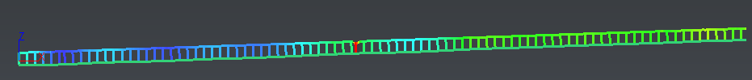

# savePolylineInspection

This script provides a functionality to create a csv file (X, Y, Z, Dev) from an inspected polyline. 

To use it, open the script editor and load savePolylineInspection.js. Select a polyline (not a set of polylines), then run the script. Finally, save the csv.

# Download Files

You can download individual file using these links (for text file, right click on the link and choose "Save as..."):

- [savePolylineInspection.js](./savePolylineInspection.js)
- [savePolylineInspection.3dr](./savePolylineInspection.3dr)
- [savePolylineInspection.csv](./savePolylineInspection.csv)