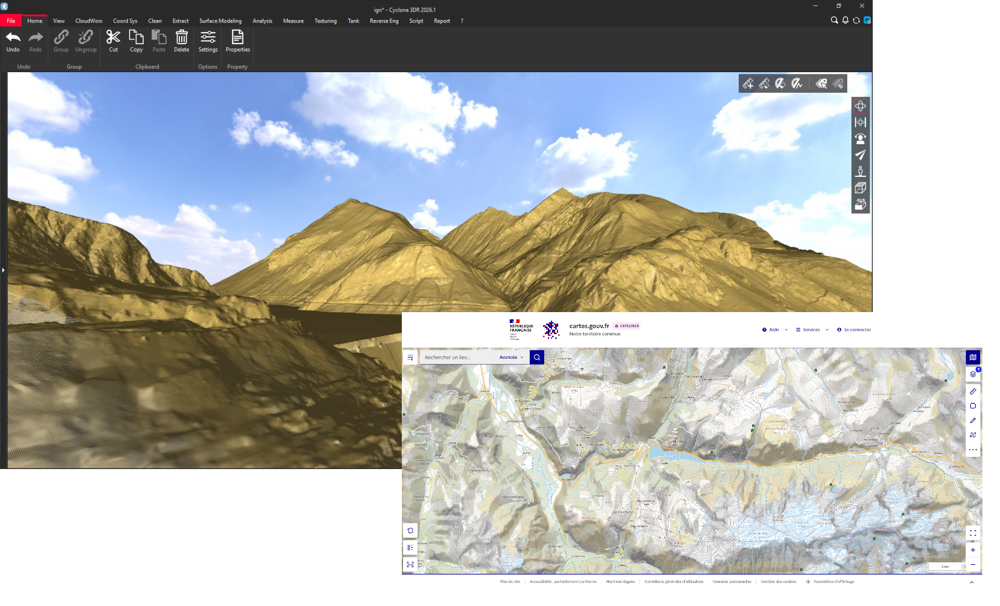

# IGN DTM Downloader

This script downloads elevation tiles from the IGN Geoplateforme ([cartes.gouv.fr](https://www.cartes.gouv.fr/)) over a user-defined area and builds one point cloud per tile directly in the document.

It illustrates advanced capabilities of the Cyclone 3DR script engine: 
* `async`/`await`, `fetch()` for HTTP requests
* dynamic `import()` of ES modules. 

The whole pipeline stays in memory: the tiles are downloaded with `fetch()` and the GeoTIFF files are decoded by the bundled module, with no binary file written to disk and no external tool required.

# How to use it

To use it, open the script editor and load `IGN_DTM_Downloader.js`.

No selection is required before launching the script, and an empty document is enough.

Launch the script and fill in the dialog:

1. Enter the **Southwest** and **Northeast** corners of the area to import, as longitude/latitude in WGS 84.
2. Optionally adjust the maximum number of parallel downloads in the **Performance** group.
3. Click OK. The script lists the matching tiles, downloads them, and adds one point cloud named `Cloud_<tile name>` per tile to the document. Progress is reported in the output console.

> [!NOTE]
>* An internet connection is required (the script queries `data.geopf.fr`).
>* The source layer is the IGN **MNT LiDAR HD** (`IGNF_MNT-LIDAR-HD:dalle`): 1 km x 1 km GeoTIFF tiles at 50 cm resolution. Every pixel becomes a point, so a single tile yields about 4 million points — keep the bounding box small to begin with.
>* Coverage is limited to the areas already published by IGN. If no tile is found for the requested bounding box, the script reports it and stops.
>* A failing tile (network error, unsupported TIFF) is skipped and does not interrupt the other tiles.
>* Tiles are only available over France, in the Lambert-93 projection (EPSG:2154) used by the source data.

# Limitations

`modules/geotiff_reader.js` is a minimal reader written for this example. It supports classic TIFF (no BigTIFF), strip-based layouts (no tiled TIFF), uncompressed data only, a single band (float or 8/16/32-bit integer), and simple north-up georeferencing (`ModelPixelScaleTag` + `ModelTiepointTag`). This covers the IGN tiles used here; for production use, prefer a full-featured GeoTIFF library.

# Requirements

* Cyclone 3DR with a script engine supporting `async`/`await`, `fetch()` and dynamic `import()` (min. version 2026.1.4)
* The `modules` and `res` folders must be kept next to the script: the module is loaded relative to the script, and the dialog header logo is resolved from `CurrentScriptPath()`.

# Download Files

You can download individual file using these links (for text file, right click on the link and choose "Save as..."):

- [IGN_DTM_Downloader.js](./IGN_DTM_Downloader.js)
- [modules/geotiff_reader.js](./modules/geotiff_reader.js)
- [modules/geotiff_reader.d.ts](./modules/geotiff_reader.d.ts)
- [res/cartes-gouv-logo-dark.svg](./res/cartes-gouv-logo-dark.svg)
