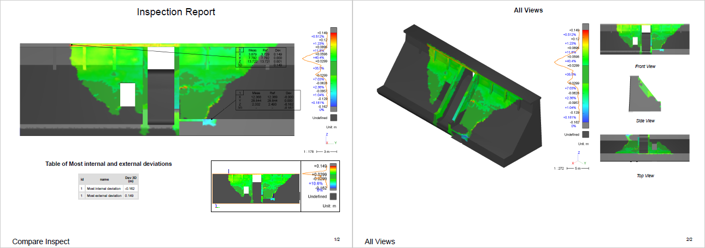

# Inspection Reports

This script provides an example which shows how to create a customized report through scripting.

To use it, open the file BestFitOnRef.3dr with Cyclone 3DR, load and run InspectionReports.js. A .pdf report will be generated using two templates.

# Download Files

You can download individual files using these links (for text file, right click on the link and choose "Save as..."):

- [InspectionReports.js](./InspectionReports.js)
- [BestFitOnRef.3dr](./BestFitOnRef.3dr)
- [CustomInspectionReport.mlt](./CustomInspectionReport.mlt)
- [Landscape_4Views.mlt](./Landscape_4Views.mlt)