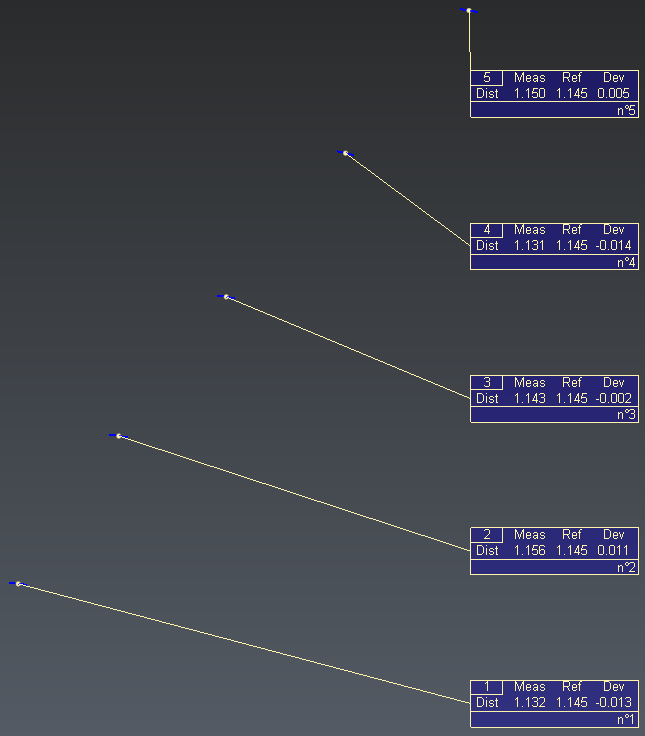

# Labels

This script provides an example which shows how to customize and batch create labels

To use it, open the script editor and load labels.js. Define the theoretical length of your set of lines inside the .js, then select the lines and run the script.  

# Download Files

You can download individual files using these links (for text file, right click on the link and choose "Save as..."):

- [labels.js](./labels.js)
- [labels_sample.3dr](./labels_sample.3dr)