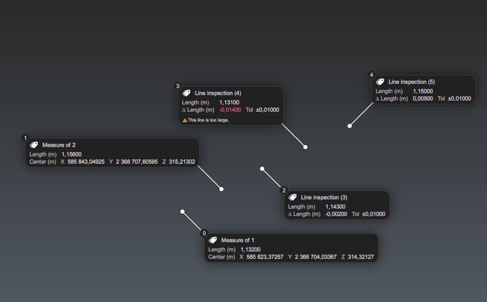
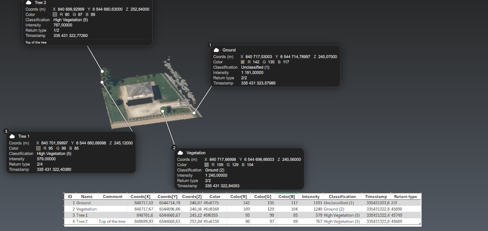

# Measures utilities

This script provides several example on how to manipulate measures in script

## CustomMeasures

This script demonstrates how to create custom measures.

## Measures2CSV

This script allows converting measures to a CSV file.

# Download Files

You can download individual files using these links (for text file, right click on the link and choose "Save as..."):

- CustomMeasures
    - [CustomMeasures.js](./CustomMeasures.js)
    - [CustomMeasures.3dr](./CustomMeasures.3dr)
- Measures2CSV
    - [Measures2CSV.js](./Measures2CSV.js)
    - [Measures2CSV.3dr](./Measures2CSV.3dr)