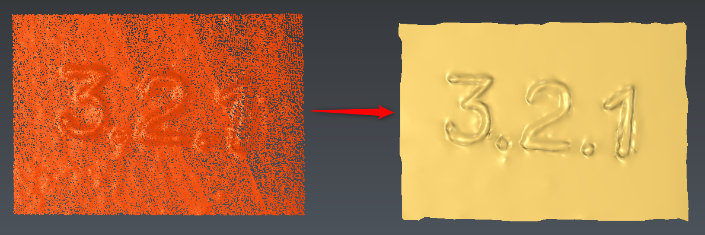

# MeshingWizard

The aim of this script is to mesh, one or several clouds, using a defined strategy: precise(MeshWizard-slow.js), normal(MeshWizard-normal.js), fast(MeshWizard-fast.js).
The general workflow is inside MeshWizard_General.js file. If you need more information regarding parameters, just open this file.
By default all values are in MM, however you can adjust them using the scaleFactor parameter.

To use this script, simply select the clouds and launch it. 

# Download Files

You can download individual file using these links (for text file, right click on the link and choose "Save as..."):

- [MeshWizard-slow.js](./MeshWizard-slow.js)
- [MeshWizard-normal.js](./MeshWizard-normal.js)
- [MeshWizard-fast.js](./MeshWizard-fast.js)
- [MeshWizard-General.js](./MeshWizard_General.js)