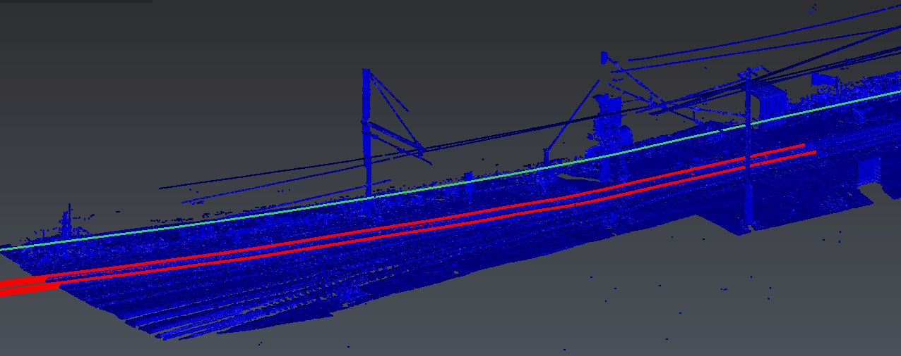

# Rail detection

This script provides a functionality to extract rails from a point cloud in Cyclone3DR.
To use it, open the script editor and load RailExtraction.js and run the script.

Note:
* This script requires the trajectory of the scanner which acquired the point cloud (often generated by mobile mapping system)
* This script is implemented so that it extracts the rails on a first point cloud and then looks for another point cloud file with incremented name in order to continue the extraction
* The extraction will continue until no file is found next
* A version of the script (RailExtraction_CW.js) works directly on a CloudWorx Cloud: LGS or JetStream data imported in Cyclone3DR. In this version, load the CW cloud as well as the trajectory before running the script

# Download Files

You can download individual file using these links (for text file, right click on the link and choose "Save as..."):

- [00_utils.js](./00_Util.js)
- [00_Variables.js](./00_Variables.js)
- [01_Initialize.js](./01_Initialize.js)
- [02_NextExtraction.js](./02_NextExtraction.js)
- [RailExtraction.js](./RailExtraction.js)
- [Track_01.laz](./Track_01.laz)
- [Track_02.laz](./Track_02.laz)
- [Trajectory.dxf](./Trajectory.dxf)
