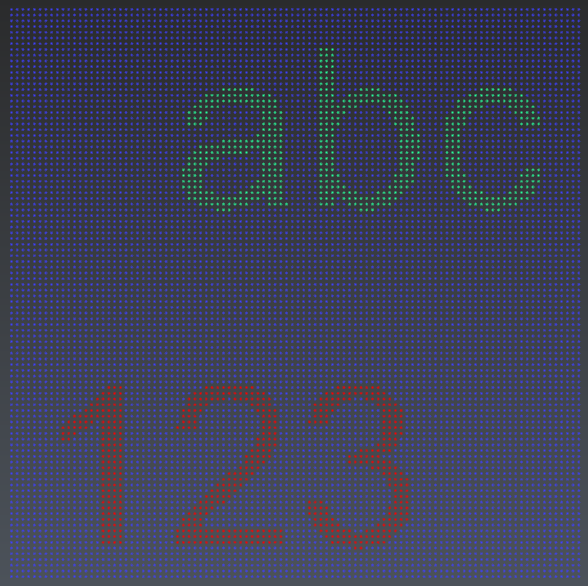

# Raster

This script generates an ASCII raster from a point cloud.

To use it, open the script editor and load Raster.js.

# HOW TO USE IT
Launch the script, set the parameters, click the point cloud and give 3 points to define the grid position and orientation. => Make sure 1 cloud is visible before launching the script

# ALGORITHM
1. The algorithm creates a cell which moves along X and Y axis of the grid. 
2. For each cell position, either the lowest, or the middle or the highest elevation of the cell content is extracted and stored.

# PARAMETERS
Parameter explanations:
1. No Data default value: default value written in the raster when the cell is empty
2. Cell Size: width and length of the cell (in document unit)
3. Nb Cols: number of columns
4. Nb Rows: number of rows
5. Use Cell Center: 
      0: the given origin will correspond to the bottom left of the pixel and the cell      
      1: the given origin will correspond to the center of the pixel and the cell
      in case of using a grid cloud, choose the option where the point will be in the cells center (not in corner)
6. Options (0=middle of bounding box,1=lowest,2=highest): the elevation that will be extracted
7. Output format (0=ESRI, 1=CSV): ESRI format stores a header part
8. Number of digits: number of digits stored for each elevation.
9. Display animation: display the moving cell (enable this only for small rasters)

# Download Files

You can download individual file using these links (for text file, right click on the link and choose "Save as..."):

- [Raster.js](./Raster.js)
- [SampleExportASC_ESRI.3dr](./SampleExportASC_ESRI.3dr)