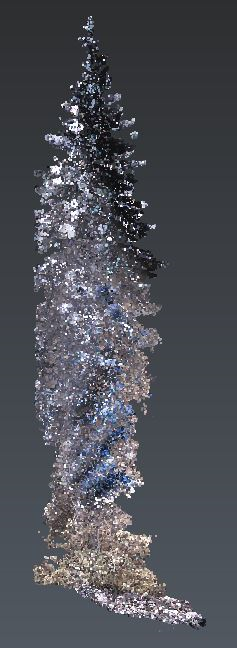
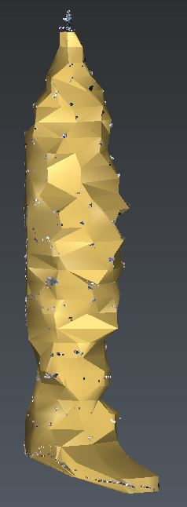

# Tree meshing

This script provides a functionality to mesh trees in Cyclone 3DR.

To use it, open the script editor and load TreeMeshing.js.

# HOW TO USE IT
The algorithm uses the selected cloud to mesh it using this tree meshing strategy! => Make sure only 1 cloud is selected before launching the script

# ALGORITHM USED
1. The algorithm creates slices of defined depth in the point cloud at regular steps in Z
2. A section of each slice is created using the convex hull algorithm
3. The sections are joined in order to create a watertight mesh

# PARAMETERS
Parameter explanations:
1. Slice step: distance between the sections that have to be created
2. Slice depth: depth of each section for creating the convex hull

# Download Files

You can download individual file using these links (for text file, right click on the link and choose "Save as..."):

- [TreeMeshing.js](./TreeMeshing.js)
- [Tree.nsd](./Tree.nsd)
